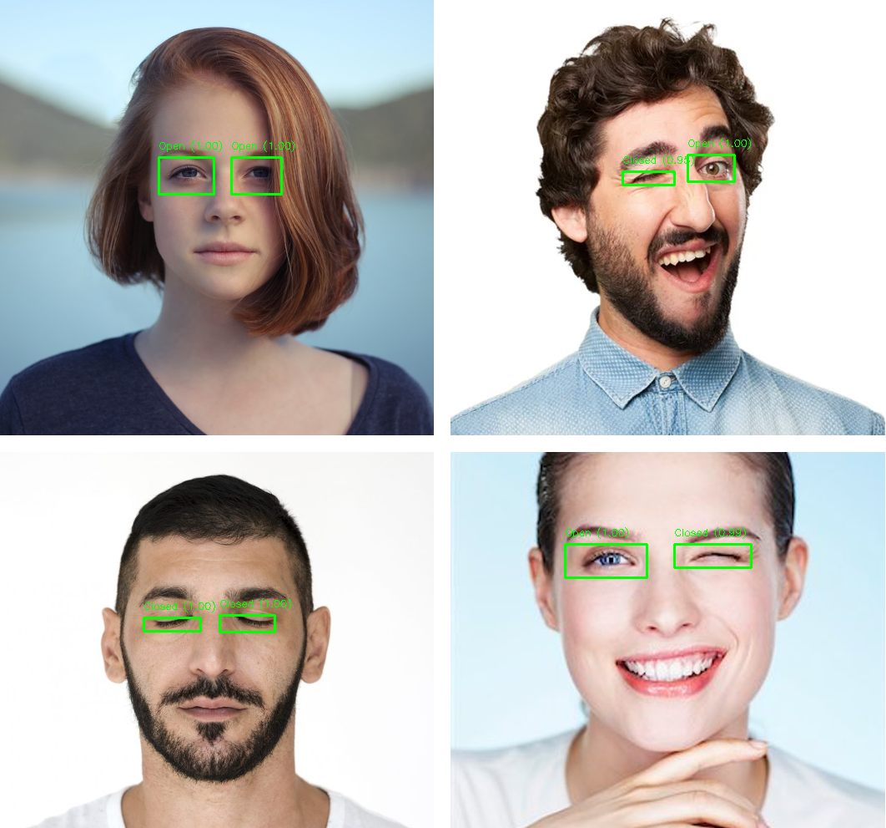

# Eye State Classification using RyzenAI with MobileNetV2 and MobileNetV3

Results from MobileNetV2 post quantized model, run on RyzenAI.

## Introduction

MobileNetV2 and MobileNetV3 models are adapted to the classification task of eye state classification i.e. open or closed eyes. Each eye is individually recognized and labelled. The model is converted and quantized to be compatible with AMD's Ryzen AI chip. Please note that this project currently only supports **ryzen-ai-1.1**

## Hardware Requirements

1. AMD Ryzen AI Chip/Hardware
2. Follow setup for IPU [here](https://ryzenai.docs.amd.com/en/latest/inst.html) 

## Dataset

The [OACE dataset](https://www.kaggle.com/datasets/muhammadhananasghar/oace-open-and-close-eyes-dataset) is used. This dataset has extra images of a **single** subject added to it (which uses a uuid naming, different from the other images) which contain distortions. Those images are removed from the dataset which brought it down half the size. Next, 10,000 random images (5k from open and 5k from close) were selected and used for the project. You can download the modified and trimmed dataset [here](https://drive.google.com/uc?export=download&id=1Qzuf3M7GOi5_JCmvHopTIe_G4IO7-hjP)

## Steps to Test The Project

1. Clone the repository

    `git clone https://github.com/SrivathsanSivakumar/Eye-State-Detection-with-RyzenAI`

2. Open Anaconda Prompt and move into the repository. Make sure to activate your conda env!
3. Run the following command to install the necessary packages

    `pip install requirements.txt`
4. Run the following command for __real-time__ webcam inference

    `python webcam_inference.py`

    This uses the onnx model quantized and converted to run with AMD's Ryzen AI chip. To explore more options go [here](#steps-to-run-full-project) 

    *If you do not have access to a webcam you can run inference using static images with the command*

    *`python static_images_inference.py`*

    *To test with a custom image use command*

    *`python static_images_inference.py --image <your image path>`*

## Steps to Run Full Project
For a complete run involving initializing the model, train, test, quantize and deploy on ipu, use the table below.

| Purpose                                                | Requisite Files                        | Information                                                                                                                                                                                                                                   |
|--------------------------------------------------------|---------------------------------------|-----------------------------------------------------------------------------------------------------------------------------------------------------------------------------------------------------------------------------------------------|
| Setup                                                  | requirements.txt                      | Run `pip install -r requirements.txt` to install required packages.                                                                                                                  |
| 1. Initialize Model   2. Prepare Dataset   3. Train, Test, and Convert Model to ONNX format | prepare_model_and_data.py, utils.py | `prepare_model_and_data.py` allows you to either load a finetuned PyTorch model or initialize a fresh model and train it. After one of two scenarios the model is tested then converted to ONNX format. **Use the command `python prepare_model_and_data.py` to run the script with default settings**. Options:     1. `-model` Specify which model you want between "*mobilenetv2*" and "*mobilenetv3*". **MobileNetV2 is selected by default**   2. `-train` Use this flag if you want to train a freshly loaded model   3. `--num_epochs` specify the number of epochs you want to train the model for     `utils.py` contains helper functions to facilitate efficient working of the script.|
| Static Quantize Model and Test | quantize_model.py| `quantize_model.py` is a script that uses Vitis AI to static quantize the model to __QDQ__ format with __QUInt8 Activation__ then the quantized model is tested to get accuracy. **Use command `python quantize_model.py` to run the script with default options**. Options:     1. `-model` Specify which model you chose in the previous script between "*mobilenetv2*" and "*mobilenetv3*". **mobilenetv2 is selected by default** |
| Inference with Webcam or Images | webcam_inferece.py, static_images_inference.py | `webcam_inference.py` allows you to use the model to classify for closed or open eyes, in real-time using your webcam. **Use the command `python webcam_inference.py` to run the script with default options**. Options:     1. `-model` Specify which model you chose in the previous script between "*mobilenetv2*" and "*mobilenetv3*". **mobilenetv2 is selected by default**     `static_images_inference.py` allows you to use the model to classify for closed or open eyes given some images. **Use the command `python static_images_inference.py` to run the script with default options**. Options:     1. `-model` Specify which model you chose in the previous script between "*mobilenetv2*" and "*mobilenetv3*". **mobilenetv2 is selected by default**  2. `--image` feed a custom image to the model|
|Pull dataset from Google Drive|get_dataset.py|`get_dataset.py` pulls the trimmmed dataset from Google Drive and extracts it to the `data` folder. **Use the command `python get_dataset.py` to run the script** |

## Model Performance Comparison

| Model       | PyTorch Acuracy        | QDQ Onnx Accuracy        |
|------------------|------------------|------------------|
| MobileNetV2    | 96%    | 99%    |
| MobileNetV3   | 97%   | 55%    |

*Note: The increase in accuracy of the Post-Quantized MobileNetV2 model might be due to the calibration data being small compared to the dataset*

*Note: More sophisticated methods of quantization might be required for the MobileNetV3 model since linear quantization results in a steep drop in accuracy.*
